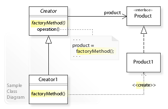

# 팩토리 메서드 패턴



```java
public abstract class Room {
    abstract void connect(Room room);
}

public class MagicRoom extends Room {
    public void connect(Room room) {}
}

public class OrdinaryRoom extends Room {
    public void connect(Room room) {}
}

public abstract class MazeGame {
     private final List<Room> rooms = new ArrayList<>();

     public MazeGame() {
          Room room1 = makeRoom();
          Room room2 = makeRoom();
          room1.connect(room2);
          rooms.add(room1);
          rooms.add(room2);
     }

     abstract protected Room makeRoom();
}
```

```java
public class MagicMazeGame extends MazeGame {
    @Override
    protected Room makeRoom() {
        return new MagicRoom();
    }
}

public class OrdinaryMazeGame extends MazeGame {
    @Override
    protected Room makeRoom() {
        return new OrdinaryRoom();
    }
}

MazeGame ordinaryGame = new OrdinaryMazeGame();
MazeGame magicGame = new MagicMazeGame();
```
